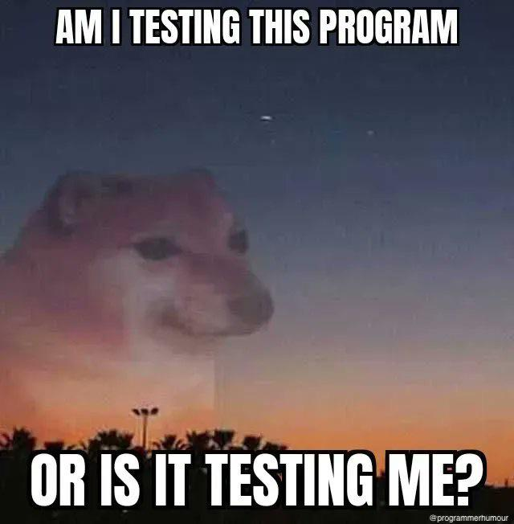

# 🧪 2. Jest ve React Testing Library'i Tanıyalım

<figure><figcaption></figcaption></figure>

## Jest Nedir&#x20;

Jest, Facebook tarafından geliştirilen, testing frameworktür. Communitysinin geniş olmasının yanı sıra Facebook ve büyük şirketlerce kullanılması bir avantaj sayılabilir. Testlerinizin benzersiz bir global duruma sahip olmasını sağlayarak Jest, testleri paralel olarak güvenle çalıştırabilir. İşleri hızlandırmak için, Jest önce başarısız olan testleri çalıştırır ve test dosyalarının ne kadar sürdüğünü temel alarak çalışmaları yeniden düzenler.

Jest'in bazı ana özellikleri şunlardır:

1. Otomatik Mocking: Jest, işlevleri ve modülleri otomatik olarak aldatmaca (mock) yapabilir. Bu, dış bağımlılıklarınızı ve bileşenlerinizi izole bir şekilde test etmenizi sağlar.
2. Basit ve İleri Düzey Eşleştirme: Jest, testlerde kullanılan değerleri karşılaştırmak için basit ve güçlü eşleştirme işlevleri sunar. Bu, beklenen sonuçları doğrulamak için çok çeşitli seçenekler sunar.
3. Snapshot Testleri: Jest, uygulamanızın çıktısını kaydedebilir ve sonraki testlerde bu çıktıyı karşılaştırmak için kullanabilir. Bu özellik özellikle UI bileşenlerini test etmek için kullanışlıdır.
4. Hızlı ve Paralel Çalışma: Jest, testlerinizi hızlı bir şekilde çalıştırmak için optimize edilmiştir ve testlerinizi paralel olarak yürütebilir.
5. İyi Belgeleme ve Topluluk Desteği: Jest, kapsamlı ve iyi belgelenmiştir ve geniş bir topluluk tarafından desteklenir. Bu nedenle, sorunlarınızı çözmek ve yeni şeyler öğrenmek daha kolaydır.
6. Uyumlu Ekosistem: Jest, React, Babel, TypeScript, Webpack gibi birçok popüler JavaScript aracı ve çerçeve ile uyumlu bir şekilde çalışır.

Jest, özellikle modern JavaScript projelerinde test otomasyonu için tercih edilen bir çerçevedir. Kod kalitesini artırmak, hata ayıklamayı kolaylaştırmak ve güvenilir yazılım geliştirmek için kullanılabilir.

## React Testing Library Nedir

React Testing Library (RTL), React uygulamalarını test etmek için kullanılan bir JavaScript test kitidir. Bu kütüphane, React uygulamalarını kullanıcı deneyimine odaklanarak test etmeyi kolaylaştırır. RTL, uygulamanızın kullanıcı arayüzünü kullanarak testler oluşturmanıza ve uygulamanızın nasıl çalıştığını anlamanıza yardımcı olur.

React Testing Library'nin bazı ana özellikleri şunlardır:

1. Kullanıcı Deneyimine Odaklanma: RTL, uygulamanızın kullanıcıların nasıl etkileşimde bulunduğunu simüle ederek test etmenizi sağlar. Bu, kullanıcıların uygulamanızı nasıl kullanacağını daha iyi anlamanıza yardımcı olur.
2. Jest Entegrasyonu: React Testing Library, Jest gibi popüler bir test çerçevesiyle sorunsuz entegre olur. Bu, testlerinizi kolayca oluşturmanızı ve çalıştırmanızı sağlar.
3. Basit ve Okunabilir API: RTL'nin API'si, React bileşenleriyle etkileşim kurmayı ve bileşenlerin durumunu ve sonuçlarını test etmeyi basit ve anlaşılır hale getirir.
4. Etkin Dökümantasyon: RTL'nin kapsamlı ve iyi belgelenmiş bir dökümantasyonu vardır, bu da yeni kullanıcılar için öğrenmesini kolaylaştırır.
5. Bileşen Bağımsızlığı: RTL, bileşenler arasındaki bağımlılıkları minimize etmenize yardımcı olur, böylece her bileşeni izole bir şekilde test edebilirsiniz.
6. Erişilebilirlik Kontrolleri: RTL, uygulamanızın erişilebilirliğini kontrol etmek için erişilebilirlik denetimleri sağlar.

React Testing Library, React uygulamalarını test etmek isteyen geliştiriciler için güçlü bir araçtır ve kullanıcı deneyimine dayalı testler oluşturmak için idealdir. Bu kütüphane, uygulamanızın istikrarını ve kalitesini artırmak için test süreçlerinizi iyileştirmenize yardımcı olabilir.
