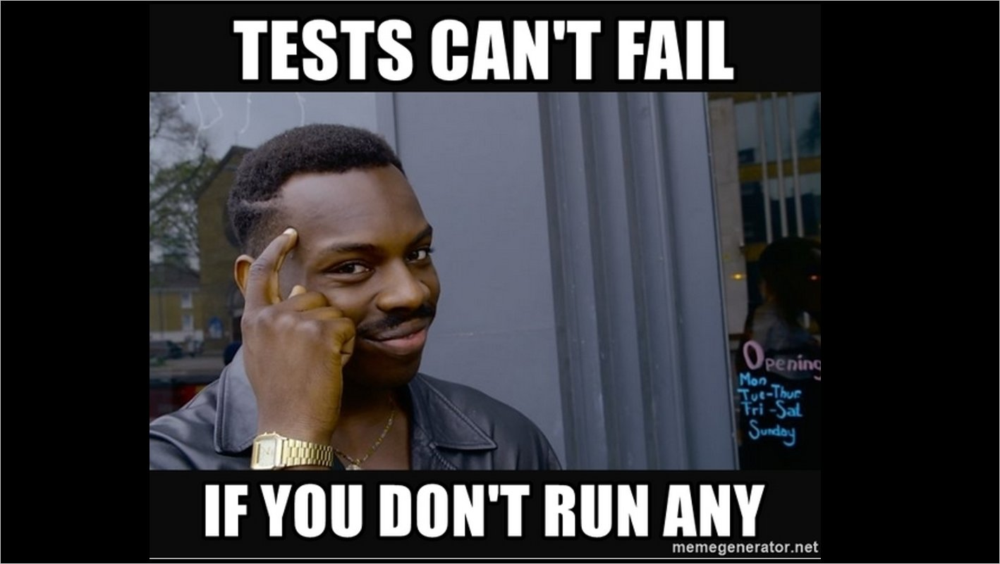

# 🥇 6. İlk Testimizi Yazıyoruz

Şimdi basit bir şekilde ilk testimizi yazalım. İlk olarak test dosyamızın içini boşaltıyoruz. Son görüntü şu şekilde.


```javascript
import { render, screen } from '@testing-library/react';
import App from './App';
```


Daha sonrasında appimizin içinde de ufak bir değişiklik yapıyoruz.


```javascript
function App() {
    return <div className="App">Modern Testing </div>;
}
export default App;
```


Şimdi genel olarak bir appimizde logomuz headerımız vs. componentlerimiz bulunur ve onun render edilip edilmediğini kontrol ederiz. Burada ki bu ufak kod için bu temelde bir test yazalım. &#x20;


```javascript
test("should render App component without crashing", () => {
  render(<App />);
  const element = screen.getByText("Modern Testing");
  expect(element).toBeInTheDocument();
})
```


Bu noktada App'i render et diyoruz. Render et derken ne oluyor diye sorarsak. Bir browserda render edermişçesine gidip Jest kendi içinde bir visual dom kullanıyor onun içerisinde render işlemlerini yapıyor.  Daha sonrasında terminale _**yarn run test**_ yazıyoruz.&#x20;

<figure><figcaption><p>Test Başarılı !</p></figcaption></figure>

Testimizin çalıştığından ekstra emin olmak istersek App.js içerisindeki textimizde ufak bir değişiklik yapıp kaydettiğimizde patladığını görebiliriz .

<figure><figcaption></figcaption></figure>

