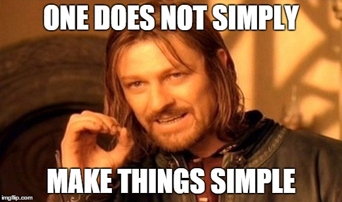

# 🥶 7. Test Driven Development Nedir - TDD

Ufak bir teorik kısıma değinmek istiyorum. Bu kısım cidden önemli bir kısım olduğunu düşünüyorum.

"TDD nedir?" sorusuna yanıt olarak, TDD veya "Test Driven Development" önce testlerin yazılması, ardından bileşenin geliştirilmesi yaklaşımını benimseyen bir yazılım geliştirme yöntemidir. Bu yaklaşım, önce test senaryolarının yazılmasını ve ardından bu test senaryolarının geçilebilmesi için gereken kodun yazılmasını içerir. Bu şekilde, yazılımın istenen işlevselliği sağlaması için doğru ve güvenilir olduğundan emin olunur.

***

Örnek verecek olursak. Öncelikle App.js dosyamızın içini boşaltalım. TDD'nin bize sunduğu bakış açısı tam olarak öncelikle testlerimizi yazıyoruz ihtiyaçlar doğrultusunda kurguladığımız componente uygun teker teker bütün testlerimizi yazdıktan sonra testini çalıştır ve bunların hepsinin patladığından emin ol daha sonra component yaz. Bunun arkasında yatan düşünce şu önce componenti yazıp daha sonra test yazarsan gözden kaçıracağımız bazı şeyler olabilir. Fakat önce test yazarken daha fazla bu componentin neye ihtiyacı var diye düşünürsün ve bu ihtiyaçlar doğrultusunda daha clean bir kod yazmış olursun.&#x20;


```javascript
function App() {
    return <></>;
}
export default App;
```


Daha sonrasında App.test.js içerisine ufak bir test daha ekleyelim bu test içerisinde App'imizi render edelim ve "Button" diye bir text var mı diye kontrol edelim.&#x20;


```javascript
import { render, screen } from '@testing-library/react';
import App from './App';

test("should render App component without crashing", () => {
  render(<App />);
  const element = screen.getByText("Modern Testing");
  expect(element).toBeInTheDocument();
});

test("should render button component", () => {
  render(<App />);
  const element = screen.getByText("Button");
  expect(element).toBeInTheDocument();
})
```


Bu noktada yarn run test dersek terminal ekranımızda fail olduklarını göreceğiz. Şimdi gidip componentimizi düzeltelim ve testlerimiz passed duruma geçsin.&#x20;


```javascript
function App() {
    return (
	<div>
	   <p>Modern Testing</p>
	   <button>Button</button>
	</div>
     );
}

export default App;

```


Tekrardan testimizi çalıştırdığımız da passed olduğunu göreceğiz 🥳.

<figure><figcaption></figcaption></figure>
